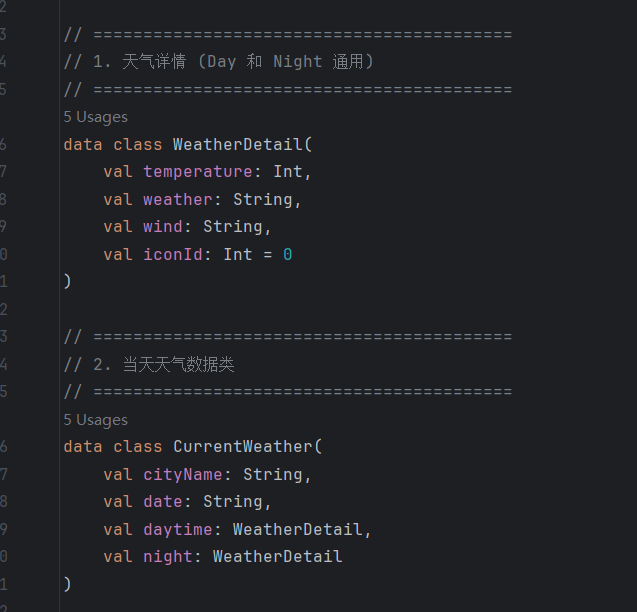
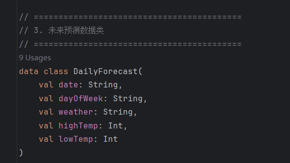
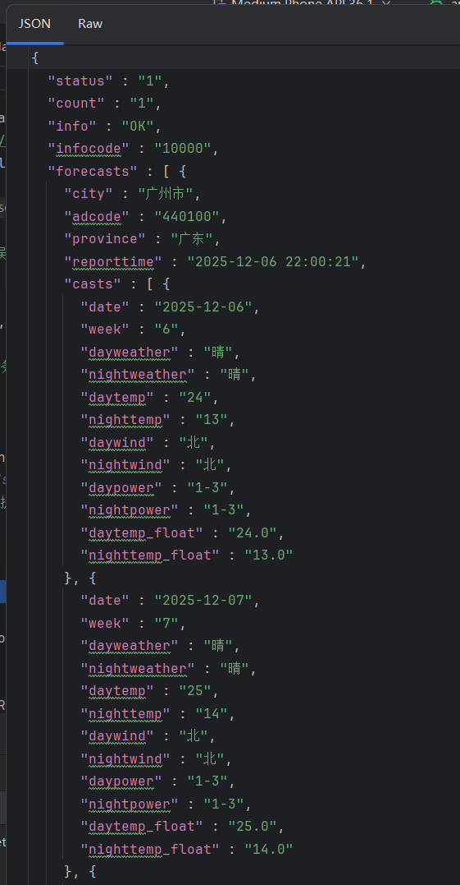
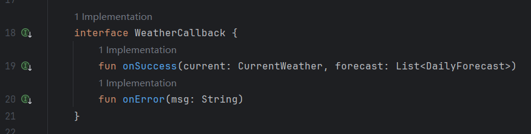
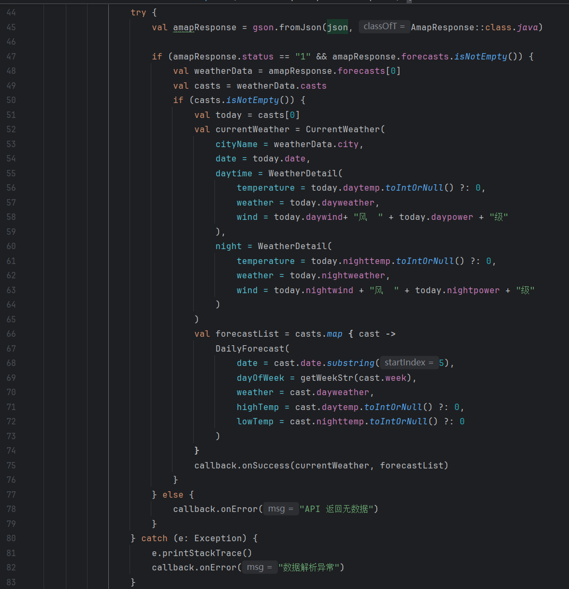
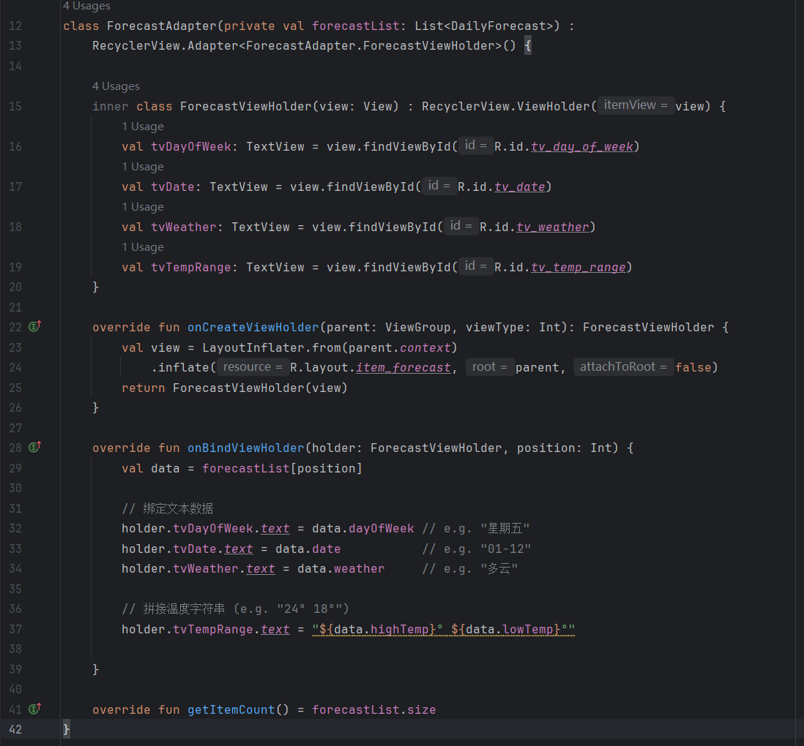
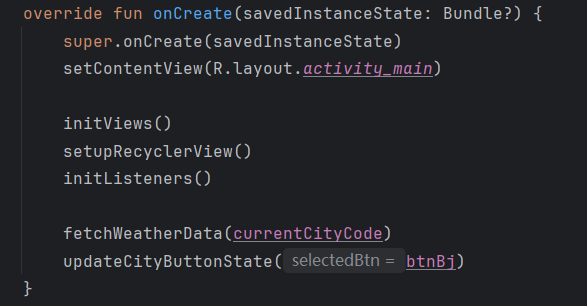

## 作业3：使用okhttp和高德api完成一个天气预报App

### 1. 根据需求定义数据类

天气分两个页面，页面1显示今日日温和夜温以及对应的天气和风向，底部可以切换城市，以及切换今日天气和预报天气页面。

其中页面1需要的数据是  白天：温度、天气、风向； 夜晚：温度、天气、风向。



页面2需要的数据是 未来星期、日期、天气、最高温、最低温



高德api返回json格式如下：



因此定义对应的解析类如下：

```Kotlin
data class AmapResponse(val status: String, val forecasts: List<AmapForecastContainer>)
data class AmapForecastContainer(val city: String, val casts: List<AmapCast>)
data class AmapCast(val date: String, val week: String, val dayweather: String, val nightweather: String, val daytemp: String, val nighttemp: String, val daywind: String, val nightwind: String, val daypower: String, val nightpower: String)
```

### 2. 写布局页面。

分三个模块分别写布局

模块1：文件activity_main.xml, 完成背景、标题、切换按钮的布局。

模块2：文件layout_today_detail.xml，完成当天白天天气和夜晚天气卡片显示。

模块3：文件item_forecast.xml， 完成预报部分四天的卡片显示。

其中切换的按钮实现的方式为改变属性android:visibility，预报页面的该属性默认为gone，在用户点击按钮后才显示。

### 3. 写okhttp获取数据的WeatherManager.kt

按照之前设定好的数据类进行返回，写接口返回两个页面分别需要的数据。



解析json装入待返回的数据类中



### 4. 写Adapter.kt

Adapter读取先前定义的forecastList数据类中的数据，填入预测天气的卡片中。



### 5.写MainActivity

重载onCreate：

initViews中绑定各组件名称；

setupRecyclerView中使用Adapter将数据装入布局；

initListeners中绑定切换城市和当前天气/预报天气的监听函数；

fetchWeatherData中调用Manager的函数通过okhttp获取天气数据，成功则更新ui数据。

最后设置默认开启App时使用的城市是北京。



